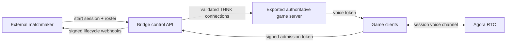

# THNK Server Platform — Implementation Plan

**Status:** Draft v1 plan

**Prepared:** 2026-07-18

**Source spec:** `THNK-Server-Platform-Blueprint.md`

## 1. What we are building

THNK Server Platform turns a GDevelop + THNK game into a deployable, authoritative multiplayer session without forcing the game developer to use a particular matchmaking service.

The v1 product has four deliverables:

1. **A proven remote-authority baseline** — the current THNK/Geckos.io path runs reliably with a headless server and two remote clients.
2. **A server export CLI** — a repeatable command packages the server half of a THNK game as a runnable artifact.
3. **An External Matchmaking Bridge** — an external matchmaker starts a session, admitted players authenticate with short-lived signed tokens, and session lifecycle events return to the matchmaker.
4. **Agora voice integration** — admitted players automatically join one voice channel per game session and receive local mute/volume controls.

The central boundary is:



The matchmaker owns grouping and player identity. The bridge owns admission and session lifecycle. The exported game server owns game state. Agora owns voice transport.

## 2. Decisions for v1

These choices close the blueprint's open questions for the first implementation:

| Topic                | v1 decision                                                                                             | Reason                                                                                                      |
| -------------------- | ------------------------------------------------------------------------------------------------------- | ----------------------------------------------------------------------------------------------------------- |
| THNK baseline        | Start from upstream `master`, then inspect selected `v2` changes; do not build from `v2` wholesale      | `master` is the latest concrete implementation; `v2` describes itself as WIP explorations                   |
| Session isolation    | One operating-system process/container per game session                                                 | Matches THNK's current single-world assumptions and makes crashes, memory, logs, and cleanup session-scoped |
| Matchmaker callbacks | Signed HTTPS webhooks with event IDs, timestamps, retry, and idempotency                                | Simpler to deploy and test than a persistent control connection                                             |
| Admission tokens     | Short-lived asymmetric JWTs; matchmaker keeps the private key and the bridge receives only a public key | Avoids giving every runtime authority to mint player tokens                                                 |
| Agora secrets        | `AGORA_APP_ID` and `AGORA_APP_CERTIFICATE` are server environment variables/secrets                     | The certificate must never be present in a GDevelop client export                                           |
| THNK Rooms/Relay     | Not a v1 dependency                                                                                     | Its documented status and production readiness are uncertain                                                |
| Transport            | Geckos.io remains the initial data transport                                                            | It is the existing dedicated-server-shaped adapter and gives the shortest path to a proof                   |
| General THNK auth    | Bridge sessions only in v1                                                                              | Direct P2P/local behavior remains compatible; broader adapter auth can be designed after the bridge works   |
| GDevelop editor UI   | No `newIDE` fork in v1                                                                                  | The supported surface is the CLI plus generated GDevelop extensions                                         |
| Voice coupling       | Voice is side-band; no audio crosses the THNK state protocol                                            | Prevents voice concerns from destabilizing authoritative state sync                                         |

## 3. Gates before feature work

### 3.1 Repository and licensing gate

The workspace does not yet contain the THNK source. Upstream verification on 2026-07-18 found:

- `master` points to commit `422d2ff0` (2024-04-03).
- `v2` points to commit `1924f02e` (2025-09-11) and its head message calls the work exploratory/WIP.
- The last published release is `alpha-4` from 2022-12-26.
- Upstream `package.json` declares `MIT`, while `LICENSE.md` contains AGPL-3.0 text.

Before distributing a fork or hosted derivative, we must establish the intended license and comply with it. Until clarified, treat AGPL-3.0 as the conservative governing assumption and preserve all notices. This is a project gate, not legal advice.

### 3.2 Technical baseline gate

Feature work begins only after we can:

- install dependencies from a clean checkout;
- run the TypeScript check and tests;
- run the full extension/adapters build;
- import the generated extensions into a compatible GDevelop version;
- launch the existing Geckos.io server;
- connect two clients and observe synchronized authoritative state;
- record the exact Node, package manager, GDevelop, browser, and Electron versions used.

## 4. Milestones

### M0 — Import and reproduce upstream

**Work**

- Create the project fork and configure `upstream` and `origin` remotes.
- Base the first development branch on upstream `master` commit `422d2ff0`.
- Compare `master` with `v2`; cherry-pick only changes supported by tests or a written rationale.
- Resolve the license declaration mismatch in project metadata/documentation before distribution.
- Pin a supported toolchain and make clean install/build/test commands deterministic.
- Add a short architecture decision record for every v1 choice in section 2.

**Exit criteria**

- Clean checkout builds without manual file edits.
- TypeScript and Jest checks pass, or every pre-existing failure is captured in a baseline report.
- Generated extension files are reproducible.

### M1 — Remote authoritative vertical slice

**Implementation status (2026-07-19):** Complete. The separate-process vertical
slice was first proven locally on `platform/m1-remote-authority`, then the
exported authority was run on an Ubuntu host and exercised by Windows browser
clients over the LAN. Fixture, runtime checks, lifecycle regressions, and
results are recorded in `docs/project/M1-REMOTE-AUTHORITY.md`.

**Work**

- Create a minimal GDevelop fixture with a synchronized player object, `State.Score`, server-side movement, and client input.
- Run the Geckos.io server and clients as separate processes first, then on separate machines or network environments.
- Instrument connect, admission, disconnect, reconnect, stop, and cleanup paths.
- Patch only the lifecycle failures that block a stable vertical slice.
- Add automated tests around every patched lifecycle transition.

**Exit criteria**

- Two clients share the same authoritative world through a non-player-hosted server.
- A client cannot directly overwrite synchronized position or score.
- Join, leave, abrupt disconnect, and server stop do not leave a ghost player or crash the session.
- The fixture and exact manual validation steps live in the repository.

### M2 — Server export CLI

**Implementation status (2026-07-19):** Complete on
`platform/m2-server-export`. The exporter, validator, hidden Electron runner,
deterministic content hash, and bundle-local dependency install pass on
Windows. The packaged artifact also runs on Ubuntu 24.04 with Xvfb and passed
remote 8-client and 16-client identity/disconnect/reconnect proofs. See
`docs/project/M2-SERVER-EXPORT.md`.

Command surface:

```text
thnk export-server --project <path> --output <directory>
thnk server validate --bundle <directory>
thnk server run --bundle <directory>
```

The stable input is a GDevelop `.json` project containing exactly one literal
Geckos `HostServer` action. The exporter imports the repository's generated
extensions and compiles the dedicated HTML5/Electron runtime itself.

**Bundle contract**

```text
server-bundle/
  manifest.json
  package.json
  server/
  assets/
  config.example.env
  README.md
```

`manifest.json` must include bundle format version, project identity, build time, required runtime version, transport, entry point, and content hash. Runtime secrets are referenced by name and never embedded.

**Exit criteria**

- One documented command produces a clean, runnable server artifact from the fixture.
- The artifact starts headlessly on a clean machine/container without the GDevelop editor or THNK source tree.
- Missing assets, incompatible project configuration, and missing runtime variables fail with actionable messages.
- Repeated exports from identical inputs are reproducible apart from explicitly documented metadata.

### M3 — External Matchmaking Bridge

**Implementation status (2026-07-19):** Complete on
`platform/m3-matchmaking-bridge`. The versioned one-session control API,
RS256/roster admission, canonical player binding, fresh-token reconnect,
signed retrying webhooks, exported-artifact process lifecycle, and adversarial
two-client proof are recorded in
`docs/project/M3-MATCHMAKING-BRIDGE.md`.

The one-session-per-process runtime exposes a versioned control contract. A provisional API, to be finalized after the Geckos transport spike, is:

```http
POST /v1/session
GET  /v1/session
POST /v1/session/end
GET  /health/live
GET  /health/ready
```

`POST /v1/session` accepts a session ID, roster of player IDs, token verification key/key ID, callback URL, and session metadata. Only one active session is permitted; conflicting starts return `409`.

Client admission must validate:

- JWT signature and allowed algorithm;
- issuer and audience;
- `sessionId` and `playerId` claims;
- expiry and not-before bounds with limited clock skew;
- roster membership;
- one active connection per player unless reconnect policy explicitly permits replacement.

Tokens must not be placed in ordinary URL query strings because URLs are commonly logged. The M1/M3 transport spike must select a browser-compatible secure handoff, such as a first authenticated protocol message or a supported WebSocket subprotocol mechanism.

Lifecycle webhooks use stable event IDs and include at least:

- `session.started`
- `player.joined`
- `player.left`
- `session.ended`

Webhook delivery is at-least-once. Receivers deduplicate by event ID. Requests are signed, retry with bounded exponential backoff, and are stored until delivered or the retention limit is reached.

**Exit criteria**

- A stub matchmaker starts one session and two token-bearing clients join it.
- Invalid, expired, wrong-session, wrong-player, and replayed admission attempts are rejected.
- Lifecycle events arrive at the stub matchmaker and retries do not create duplicate logical events.
- Ending a session drains clients, stops the game loop, and exits cleanly.

### M4 — Agora voice

**Server work**

- Load Agora credentials only from server-side secrets.
- Mint the shortest practical RTC token for the admitted player and current session channel.
- Derive safe Agora channel and UID values from canonical session/player identities.
- Rate-limit token issuance and support refresh before token expiry.

**GDevelop/client extension surface**

- Join Session Voice
- Leave Session Voice
- Mute/Unmute Self
- Mute/Unmute Remote Player
- Set Remote Player Volume
- Voice Connection State
- Player Is Speaking (if supported reliably by the selected SDK)
- Voice Error Code / Last Voice Error

Automatic voice join happens only after game admission succeeds. Failure to join voice must not disconnect a player from the game session.

**Exit criteria**

- Two admitted clients join only their session's channel and exchange audio.
- App Certificate and bridge signing secrets are absent from client files and network responses.
- Per-listener mute/volume changes affect only the local listener.
- Leave, disconnect, reconnect, token refresh, microphone denial, and Agora outage paths are handled without breaking gameplay.

### M5 — Product hardening and release candidate

**Work**

- Run the complete two-client test plan locally and on a remote host.
- Add structured logs keyed by `sessionId`, `playerId`, connection ID, and lifecycle event ID, with tokens/secrets redacted.
- Add health/readiness checks, graceful shutdown, payload limits, rate limits, and dependency timeouts.
- Publish a container example, stub matchmaker, fixture game, configuration reference, threat model, and troubleshooting guide.
- Define bundle and control API compatibility/versioning policy.

**Exit criteria**

- A new developer can export, launch, start, join, play, speak, leave, and stop the fixture by following only repository documentation.
- CI proves build, unit tests, integration tests, secret scanning, and the headless smoke test.
- Known limitations and out-of-scope items are documented.

## 5. Test strategy

Testing is layered so protocol and security failures are caught before full GDevelop tests:

| Layer       | Coverage                                                                                                                                |
| ----------- | --------------------------------------------------------------------------------------------------------------------------------------- |
| Unit        | token claims, roster rules, state transitions, webhook signatures/retries, channel/UID derivation, config validation                    |
| Contract    | matchmaker control API, webhook schema, bundle manifest, error codes, compatibility versions                                            |
| Integration | Geckos connect/disconnect/reconnect, server process lifecycle, exported artifact boot, Agora token generation                           |
| End-to-end  | stub matchmaker + exported fixture + two clients + authoritative movement/state + voice                                                 |
| Adversarial | expired/wrong-session/replayed tokens, duplicate starts, abrupt disconnects, oversized payloads, callback outage, secret leakage checks |

Every bug found manually in M1–M5 should first gain the smallest useful regression test.

## 6. Security and operational requirements

- All external traffic uses TLS outside local development.
- Private signing keys, shared webhook secrets, and the Agora App Certificate remain server-side.
- Logs redact authorization material and do not record admission tokens.
- Control endpoints require matchmaker authentication independent of player admission JWTs.
- Allowed JWT algorithms and issuers are configured explicitly; algorithm fallback is forbidden.
- Session and player identifiers are validated before use in paths, logs, metrics, process arguments, or Agora identifiers.
- The runtime has graceful termination and a maximum session duration so abandoned processes are reclaimable.
- v1 promises process isolation, not multi-session scheduling, autoscaling, failover, persistence, or DDoS protection.

## 7. Out of scope for v1

- Matchmaking algorithms, lobby UI, ELO/ranking, accounts, or player databases.
- Multiple game sessions inside one THNK process.
- A GDevelop `newIDE` export button.
- THNK Rooms/Relay or THNK Cloud completion.
- General authentication for Local/P2P/direct Geckos adapters.
- State persistence, replicas/failover, rollback netcode, teams, or split screen.
- Server-side audio mixing or recording.

## 8. First executable work package

The first implementation package is **M0 + the local half of M1**:

1. Obtain the intended GitHub fork URL/owner and clone it into this workspace.
2. Add upstream `arthuro555/THNK` as the read-only upstream remote.
3. Record the baseline commit and tool versions.
4. Install, type-check, test, and build without modifying behavior.
5. Build the minimal GDevelop authority fixture.
6. Start the existing Geckos.io server and connect two local client processes.
7. Produce a short baseline report listing what works, what fails, and the minimum lifecycle patches needed next.

This work package deliberately proves the riskiest inherited assumption before we design the exporter around it.

## 9. Definition of v1 done

V1 is complete when a developer can take the repository's fixture THNK game, run one CLI export, deploy the resulting artifact, have an arbitrary stub matchmaker start a single isolated session, admit two signed-in clients into an authoritative shared world, automatically connect them to session voice, receive reliable lifecycle callbacks, and shut the process down cleanly—with no private credential present in the client bundle.
