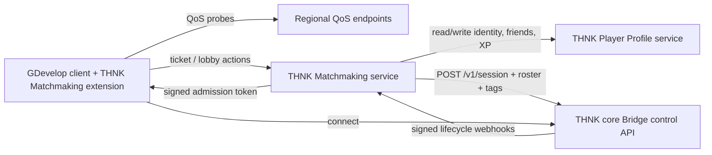

# THNK Matchmaking — Implementation Plan

**Status:** Draft v1 plan
**Prepared:** 2026-07-19
**Source spec:** `THNK-Server-Platform-Blueprint.md`, `THNK-Implementation-Plan.md` (THNK core, M0-M4 complete), project DEVLOG discussion 2026-07-18/19
**Repository:** New, separate from THNK core (`THNK-Matchmaking`)

## 1. What we are building

THNK core (the other repository) proved a remote-authority game server, a deterministic server export, a per-session Bridge with signed admission tokens, and session voice. It deliberately stopped short of matchmaking — M3's bridge only starts one session when *something else* calls it.

THNK Matchmaking is that something else: the external matchmaker THNK core's Bridge was designed to be called by. One deployment of THNK Matchmaking serves one THNK game (a single GDevelop+THNK project, potentially exporting multiple selectable server authorities/modes) — it is not a shared multi-game marketplace backend. Its job:

1. Let a GDevelop client measure regional network quality, request a match (public queue) or organize a private lobby/party, and receive an assignment.
2. Decide which players play together, which region/build/authority they run on, and — for team modes — which team each player lands on.
3. Call the assigned THNK server instance's Bridge control API (`POST /v1/session`) to start the session with the resolved roster, and hand players a signed admission token scoped to that exact session/authority/build.
4. Track session lifecycle via the Bridge's existing signed webhooks (`session.started`, `player.joined`, `player.left`, `session.ended`).
5. Provide the real-time layer (chat, presence broadcast, lobby invites) that a GDevelop game's social features need, without owning player identity itself — that stays in THNK Player Profile (separate repository, separate document).

This plan was informed by reviewing a working, production-tested reference system (an existing Node.js/Redis/Socket.IO matchmaking backend for wagered games, provided for reference only — not something THNK Matchmaking extends or depends on). Several of its patterns are proven enough to copy: Redis-backed queues keyed by mode, private lobbies with short join-codes, ready-check auto-start, host reassignment on leave, TTL-based ephemeral chat, and presence via Redis TTL + client heartbeat. Where this plan copies a pattern from that system, it says so.



## 2. Decisions for v1

| Topic | v1 decision | Reason |
|---|---|---|
| Scope boundary | Matchmaking owns grouping, region/authority selection, lifecycle tracking, and the real-time social layer (chat/presence transport). It does not own player identity, friend graph storage, or persistent profile data — that is Player Profile's job, called over API. | Mirrors the Bridge/Matchmaker separation already established in THNK core; keeps identity swappable independently of matchmaking. |
| Realtime transport | One Socket.IO (or equivalent) gateway per Matchmaking deployment, multiplexing lobby state, ticket status, chat delivery, and presence broadcast over a single client connection. | Avoids the client opening a second socket to Player Profile just for chat/presence; the reference system already proves this single-gateway shape works. |
| State store | Redis for all ephemeral state (queues, tickets, lobbies, presence, world chat) using a `service:entity:id` key convention, matching the reference system's `queue:`, `private_lobby:`, `active_game:` style. No durable database in this repository. | Ephemeral-by-design state has no business in a durable store; keeps this service horizontally scalable and stateless apart from Redis. |
| Horizontal scaling | Multiple Matchmaking instances may run concurrently against one shared Redis. Queue pop/claim operations must be atomic (Lua script or Redis transaction) so two instances cannot double-place the same player. | Directly requested: "we can have multiple matchmaking servers for load balancing... because they're using the same Redis". |
| Team/party tagging | Matchmaking assigns an opaque `tags` map (e.g. `{ "team": "A" }`) per player as part of the roster it sends to the Bridge; THNK core carries it through the signed admission token without interpreting it. | Confirmed via code review that no team/party concept exists anywhere in the reference system either — this is new design, not an adaptation. Keeps THNK core ignorant of any specific team-size/party-size assumption. |
| Voice token issuance | THNK Matchmaking holds the Agora App ID/Certificate and mints tokens (mirrors the reference system's single `/agora/token`-style endpoint), issuing a voice grant to the Bridge at session-start time rather than the Bridge minting its own from bundle-local credentials. | Avoids two independent Agora credential configurations (Matchmaking's and each exported server bundle's) for the same deployment; the exported bundle's own M4 voice path remains available as a fallback for standalone THNK use without a matchmaker. |

M6 Core contract: session creation sends an all-or-none `voiceGrants` object
keyed by canonical roster player ID. Every grant contains `appId`, one shared
session `channel`, a distinct `uid`/`token`, `expiresAt`, a player-specific
`refreshUrl`/`refreshCapability`, and `refreshOwner: "matchmaker"`. Matchmaking
owns that refresh endpoint and its authorization; Core validates/passes the
grant but never refreshes or proxies it. A grant may remain stable for that
player across a fresh gameplay reconnect until Matchmaking replaces/expires it.
| World/global chat | Ephemeral, TTL-deleted (default 60 minutes, configurable), stored in Redis, lives in this repository. | Matches the explicit requirement and mirrors the reference system's proven `GLOBAL_CHAT_TTL_MINUTES` cleanup design; no durable storage needed for something that expires anyway. |
| Friend DMs | Not stored here. Matchmaking's realtime gateway delivers them live (push), but the message itself is written/read through Player Profile's API. | Friend messages are identity-linked and expected to persist — that data ownership belongs with Player Profile, consistent with the repo split. |
| QoS measurement | Application-level HTTPS/WebSocket round-trip probes against small regional endpoints; no raw ICMP (browsers cannot do this). Bandwidth measurement is opt-in per queue config, off by default. | Browsers cannot issue ICMP pings; a full speed test before every match delays matchmaking and costs the player data for no default benefit. |
| FPS/performance signal | Measured client-side only (recent frame-time history or an optional benchmark scene), reported as a coarse tier (`low`/`medium`/`high`), and treated as untrusted input, never as a hard matchmaking filter by default. | The server cannot observe the player's actual device performance; only the client can. Modified clients can lie, so it must never gate anything security-sensitive. |
| Geographic region | Derived server-side from the player's public IP via a GeoIP provider (e.g. MaxMind GeoLite2/GeoIP2). Infrastructure region (which fleet actually hosts the match) is chosen from measured QoS, not the GeoIP label alone. | GeoIP tells you where a player *is*; it does not tell you which server actually gives them the best connection. Keeping them distinct avoids routing a player to a "nearby" region that measures worse than a farther one. |
| Multi-authority routing | Matchmaking resolves a client's `queueId` to a ruleset, `modeId`, `authorityId`, optional `mapId`, and target server build, then passes `authorityId`/`serverBuildId` as claims in the admission token it requests from the Bridge. | Directly extends the multi-authority design already agreed for THNK core's exporter/manifest; Matchmaking is the thing that actually resolves player-facing mode names to server-side authority IDs. |

## 3. Data model (Redis key conventions)

Adopting the reference system's naming convention directly, namespaced under `mm:`:

```text
mm:queue:{queueId}                 list of playerIds waiting (FIFO within a queue)
mm:queue_entry:{playerId}          ticket data: party, tags, QoS, attributes, queuedAt
mm:party:{partyId}                 party roster + leader + ready state
mm:player_party:{playerId}         → partyId (which party a player is currently in)
mm:lobby:{lobbyId}                 private lobby record (admin, mode, config, shortCode)
mm:lobby_players:{lobbyId}         hash of playerId → player state (ready, joinedAt)
mm:lobby_short_code:{code}         → lobbyId
mm:active_session:{sessionId}      set of playerIds currently in that session
mm:active_player:{playerId}        → { sessionId, authorityId, region, voiceChannel }
mm:online:{playerId}               presence TTL key (heartbeat-refreshed)
mm:chat:global:{messageId}         world chat message, TTL = configured retention
```

This is a starting point, not a frozen contract — exact fields get finalized during M1/M2 implementation, but the key *shape* (service-prefixed, colon-delimited, entity-then-id) should stay consistent with what's already proven in production.

## 4. GDevelop extension surface (client-side actions/conditions/expressions)

### Identity & configuration
- `Configure Matchmaking Endpoint`
- `Set Client Build ID` / `Set Protocol Version`
- Player access token is supplied by the Player Profile extension (short-lived, not a raw API key) — Matchmaking never accepts a long-lived secret from the client.

### Network quality (async — matches the reference system's requirement that ping never gate on a single sample)
- `Measure Regional Network Quality` (action; tests all configured regions)
- `NetworkQualityTestComplete()` (condition)
- `RegionPing(regionId)`, `RegionJitter(regionId)`, `RegionPacketLoss(regionId)`, `RecommendedRegion()` (expressions)
- `Run Performance Benchmark(sceneName)`, `PerformanceBenchmarkComplete()`, `PerformanceTier()` (optional, opt-in per game)

### Tickets, parties, queues
- `Find Match(queueId)` / `Cancel Matchmaking`
- `Create Party` / `Invite To Party(playerId)` / `Leave Party` / `Set Party Ready`
- `Set Matchmaking String/Number/Boolean Attribute(key, value)` — developer-supplied ticket attributes (e.g. XP); server-validated/overridden for ranked modes, never trusted as-is from the client
- Conditions/expressions: `MatchmakingInProgress()`, `MatchFound()`, `MatchmakingFailed()`, `LastMatchmakingError()`, `MatchmakingQueueTimeSec()`, `AssignedRegion()`, `AssignedAuthorityId()`

### Private lobbies
- `Create Private Lobby(modeId)` / `Join Private Lobby(codeOrId)` / `Leave Private Lobby`
- `Set Lobby Ready(bool)` / `Kick From Lobby(playerId)` / `Start Lobby` (host-only; auto-starts on all-ready by default, mirroring the reference system's UX)
- Expressions: `LobbyShortCode()`, `LobbyPlayerCount()`, `LobbyReadyCount()`, `IsLobbyAdmin()`

### Connecting
- `Connect To Assigned Server` — consumes the admission token/session address returned on `MatchFound`/lobby-start and hands off to THNK core's existing `Connect to server with admission token` action.

### Chat & presence (transport only — data ownership per §2)
- `Send Global Chat Message(text)` / `On Global Chat Message Received`
- `Send Friend Message(playerId, text)` / `On Friend Message Received` (round-trips through Player Profile's API server-side)
- `On Friend Presence Changed(playerId, online)`

## 5. Team/party tagging design

Extends the multi-authority admission claims already defined in THNK core:

```json
{
  "sessionId": "match-123",
  "playerId": "player-a",
  "authorityId": "duel",
  "serverBuildId": "sha256:...",
  "tags": { "team": "A", "squad": "A2" }
}
```

Matchmaking owns all sizing/assignment rules as queue configuration — team size, party size caps, whether a party is guaranteed to land on one team — none of it hardcoded. Example queue config:

```json
{
  "queueId": "public-team-duel",
  "modeId": "duel",
  "teamSize": 4,
  "teamCount": 2,
  "keepPartiesTogether": true
}
```

When a party queues together for a team-based mode, the assignment step places the whole party on one team before backfilling with strangers, then emits the resolved `tags.team` value per player into the roster it sends to the Bridge. THNK core's Team-reading logic just trusts the claim; it never re-derives grouping itself.

## 6. Milestones

### M0 — Baseline and contracts

**Work**
- Stand up the repository, pin toolchain, wire Redis + Socket.IO + HTTP server skeleton.
- Define the ticket, party, lobby, and roster JSON contracts referenced throughout this document; add ADRs for the decisions in §2.
- Implement a stub THNK core Bridge (or point at a real exported fixture bundle from THNK core M1-M3) for integration testing.

**Exit criteria**
- Clean install/build/test on a fresh checkout.
- A stub client can open a socket connection and receive a presence snapshot.

### M1 — Public queue and session handoff

**Work**
- Implement ticket submission, FIFO queue-window matching (mirroring the reference system's queue-window design), and atomic claim/pop so multiple Matchmaking instances sharing Redis cannot double-place a player.
- Implement the call into the Bridge's `POST /v1/session` with a resolved roster and receive admission tokens back (Matchmaking requests token issuance; the actual signing key ownership follows THNK core's existing asymmetric-JWT decision — Matchmaking holds the private key, Bridge holds only the public key, per the M3 design already in place).
- Implement lifecycle webhook receipt (`session.started`/`player.joined`/`player.left`/`session.ended`) with signature verification and idempotent handling.

**Exit criteria**
- Two clients request a match on the same queue, are grouped, and both receive a valid admission token for the same session.
- Ending the session (via the Bridge) is reflected back to Matchmaking through the webhook, and the ticket/active-session state is cleaned up.
- A forced two-instance test (both pointed at the same Redis) never double-places one player into two sessions.

### M2 — Private lobbies and parties

**Work**
- Implement party creation/invite/ready (friend-gated — requires a Player Profile friendship check, matching the reference system's "silently reject if not friends" pattern).
- Implement private lobbies with short join-codes, ready-check auto-start, host reassignment on leave, and idle-lobby cleanup.
- Wire lobby-start into the same session-handoff path as M1's public queue.

**Exit criteria**
- A 4-player private lobby created by one host, joined by three others via short code, auto-starts when all ready, and produces a valid multi-player session on THNK core.
- Host leaving before start reassigns admin to the next-oldest member; host leaving after start does not end the session.

### M3 — Team/party tagging and multi-authority routing

**Work**
- Implement queue-level team-size/party-size configuration and the tag-assignment algorithm described in §5.
- Implement `queueId` → ruleset → `modeId`/`authorityId`/`mapId`/server-build resolution, per the multi-authority design already agreed for THNK core's exporter.
- Reject/redirect clients whose requested queue doesn't exist or whose build is incompatible (`client_update_required`), per the compatibility-version design in the THNK core roadmap discussion.

**Exit criteria**
- A party of 2 queuing into a 4-player team mode is always placed on the same team; backfilled strangers fill the remaining slots and the other team.
- A request for an unknown `queueId`/`modeId` is rejected before any session is created.
- An incompatible client build is rejected with a stable error code before entering a queue.

### M4 — Regional QoS and routing

**Work**
- Deploy small regional QoS probe endpoints; implement the client-facing async `Measure Regional Network Quality` contract (median/percentile RTT, jitter, timeout rate — never a single-sample decision).
- Implement GeoIP-based candidate region shortlist plus QoS-based final region selection; implement party-aware region selection (minimize the worst acceptable experience across the party, not just the average).
- Implement opt-in bandwidth measurement per queue config, off by default.

**Exit criteria**
- A simulated multi-region test produces a `RecommendedRegion()` that matches measured QoS, not just geographic proximity, when the two disagree.
- A party split across two GeoIP regions still converges on one selected region.

### M5 — Chat, presence, and voice grant issuance

**Work**
- Implement world chat (Redis-backed, TTL-deleted, rate-limited) and the presence broadcast/heartbeat/snapshot pattern, both proven in the reference system.
- Implement friend-message transport (delivery only — storage via Player Profile's API) and unread-count push.
- Implement Agora credential ownership and voice-grant issuance at session-start (§2), including the lobby-channel → session-channel handoff.

**Exit criteria**
- Two clients in the same session's voice channel can be issued distinct, session-scoped voice grants without either holding the raw Agora App Certificate.
- World chat messages older than the configured TTL are unreadable/deleted; friend DMs persist through Player Profile and are delivered live when both parties are connected.

### M6 — Hardening and horizontal scale proof

**Work**
- Run two or more Matchmaking instances against one shared Redis under concurrent load; prove no double-placement, no lost tickets, no orphaned lobbies.
- Add structured logs keyed by ticket/session/lobby ID with secrets redacted, health/readiness endpoints, and graceful shutdown.
- Document the full deployment contract: required env vars, Redis topology, Bridge connectivity requirements, Player Profile API dependency.

**Exit criteria**
- A documented load test demonstrates correct behavior with multiple Matchmaking instances and concurrent matching across at least two regions.
- A new developer can stand up Matchmaking, THNK core, and Player Profile together and run the full public-queue and private-lobby paths end to end using only repository documentation.

## 7. Test strategy

| Layer | Coverage |
|---|---|
| Unit | ticket/party/lobby state transitions, tag-assignment algorithm, QoS aggregation, GeoIP→region shortlist logic |
| Contract | Bridge control API calls, admission token claims, webhook schema/signatures, Player Profile API calls |
| Integration | Redis-backed queue/lobby lifecycle, multi-instance concurrency, session handoff against a real exported THNK core bundle |
| End-to-end | public queue match, private lobby match, team-mode party placement, region selection, voice grant issuance, chat/presence |
| Adversarial | duplicate/replayed match requests, two instances racing the same ticket, forged tags, wrong-build/wrong-authority requests, friend-gated actions attempted between non-friends |

Every defect found manually should gain the smallest useful regression test, consistent with THNK core's existing discipline. Testing should run against a real Linux host and a real exported THNK core server bundle wherever the milestone's exit criteria depend on session handoff, not just mocks.

## 8. Security and operational requirements

- All external traffic uses TLS outside local development.
- Matchmaking's private JWT signing key, Agora App Certificate, and inter-service tokens remain server-side only; logs redact them.
- Every call into the Bridge's control API and Player Profile's API uses its own service-to-service authentication, independent of player-facing tokens.
- Ticket attributes that affect ranked outcomes (e.g. XP) are validated/overridden against Player Profile's authoritative record before being used in matching — never trusted as-is from the client.
- Session/player/lobby identifiers are validated before use in Redis keys, logs, or outbound requests.
- Rate limits apply to match requests, lobby creation, and chat, matching the reference system's proven per-action limits as a starting point.

## 9. Out of scope for v1

- Skill-based/ELO matchmaking (v1 is stake/mode/team-size/QoS based, matching the reference system's proven FIFO-window approach; ranked ELO can be added as a later attribute-weighted extension).
- Cross-region session replication/failover.
- A GDevelop `newIDE` export button for matchmaking configuration (config is server-side/JSON in v1, same boundary as THNK core).
- Wallet/staking/payments — that is a business-specific concern of individual games (see Player Profile plan §"Out of scope"), not a THNK Matchmaking responsibility.
- Warm-worker/pre-warmed server pooling (cold assignment only, per THNK core's roadmap decision).

## 10. Definition of v1 done

V1 is complete when a GDevelop+THNK game can, using only this repository plus THNK core and THNK Player Profile: measure regional QoS, find a public match or create/join a private lobby, have a party consistently land on one team in a team-based mode, get routed to the correct authority/build for its selected mode, receive a valid signed admission token, connect and play, exchange world and friend chat, see friend presence, join session voice without any client ever holding an Agora certificate — and do all of this correctly with more than one Matchmaking instance running against shared Redis.
