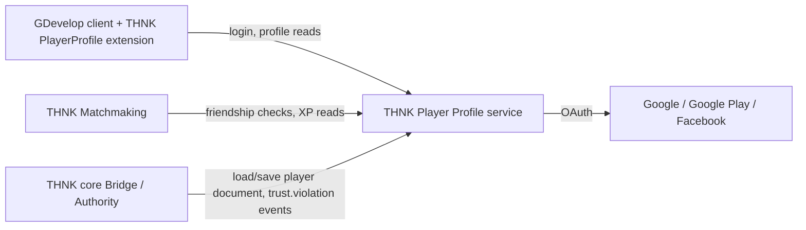

# THNK Player Profile — Implementation Plan

**Status:** Draft v1 plan
**Prepared:** 2026-07-19
**Source spec:** `THNK-Server-Platform-Blueprint.md`, `THNK-Implementation-Plan.md` (THNK core, M0-M4 complete), project DEVLOG discussion 2026-07-18/19
**Repository:** New, separate from THNK core and THNK Matchmaking (`THNK-PlayerProfile`)

## 1. What we are building

THNK Player Profile is the canonical player identity and persistent-data service. It owns the one thing neither THNK core nor THNK Matchmaking should own: who a player actually is, what belongs to them permanently, and who they're friends with. Matchmaking calls it to check friendships and read authoritative attributes (like XP) for ranked queues; the exported THNK core Authority calls it (through the Bridge, server-side only) to load and persist developer-defined player data during a session.

This plan was informed by reviewing a working, production-tested reference system (an existing Node.js/Postgres backend handling login, friends, and chat for a wagered-game platform, provided for reference only — not something Player Profile extends or depends on). Its identity, friendship, and chat schema are proven enough to use as a direct template.



## 2. Decisions for v1

| Topic | v1 decision | Reason |
|---|---|---|
| Identity model | One canonical `playerId` (UUID) per person. Login providers (Google, Google Play Games, Email/password, Facebook; Apple deferred) are identity *links* in a separate table, not separate accounts. | Matches the reference system's `users` table shape, generalized from a single `google_id` column to a proper `player_identities(provider, providerUserId) → playerId` table so more providers can be added without schema churn. |
| Account linking | Automatic linking only when the incoming identity's email is provider-verified AND no existing account is already linked to a *different* verified identity with that email. All other overlaps require an explicit, authenticated relink step (log in as the existing account, then connect the new provider) — never a silent merge triggered by an unauthenticated login. | The reference system's Google-only implementation silently attaches `google_id` to any account matching the verified email; that's acceptable specifically because Google always returns verified emails, but is not safe to copy verbatim once Facebook (which can return unverified emails) is added. |
| Developer-defined player data | One schema-validated JSON document per player. The developer declares field names/types (string/number/bool/array) as project metadata; the service validates reads/writes against that schema. No live DDL (`CREATE TABLE`/`ALTER TABLE`) per project. | Auto-generating real SQL tables/columns per developer field is an operational and injection risk and doesn't scale across many tenant projects sharing infrastructure; a validated document gets the same developer ergonomics safely. |
| Data sync trust model | The exported THNK core Authority is the only writer during a session (read on session start, write-through on relevant events/session end). Clients never write profile data directly. | Mirrors THNK core's existing `State.` variable trust model exactly — server-authoritative, client never mutates trusted state directly. Keeps the whole system philosophically consistent instead of introducing a second trust model just for persistence. |
| Storage | Postgres for all durable data (identities, profile documents, friendships, direct messages, moderation records). No wallet/currency tables — out of scope (see §9). | Matches the reference system's proven schema shape for everything except money, which is a business-specific concern this repository should not assume every THNK game needs. |
| Friends | `friendships(id, requester_id, addressee_id, status)` with `pending`/`accepted`/`blocked`, directly modeled on the reference system's schema. | Already proven in production; no reason to redesign it. |
| Direct messages | Persistent, paginated, read-receipt tracked (`direct_messages` with `read_at`), modeled directly on the reference system's schema. Delivered live through THNK Matchmaking's realtime gateway when the recipient is connected; always readable via this service's API regardless of connection state. | Friend messages are expected to persist, unlike Matchmaking's ephemeral world chat — this is the correct place to own that data. |
| Presence data | This service does not track live socket connections (that's Matchmaking's realtime gateway) but does expose a `GET /presence/{ids}` read that Matchmaking's gateway calls to bootstrap a presence snapshot, and accepts presence-changed pushes from Matchmaking to keep any cached "last seen" timestamp current. | Keeps exactly one source of truth for live connection state (Matchmaking) while letting Player Profile still answer "when did X last play" outside of a live session. |
| Moderation / cheat tracking | THNK core emits a `trust.violation` webhook event (session, player, violation type, timestamp) using the same signed-webhook mechanism already built for session lifecycle events. This service ingests it, tallies per player, and exposes an admin block/unblock flag that the Bridge checks at admission. | Reuses existing, tested transport instead of inventing a second event pipe; directly answers "can those violations be tracked and used to auto-block." |
| Auth tokens (this service's own API) | Symmetric session JWT (HS256, cookie + bearer), matching the reference system's proven pattern. | This is a different threat model from THNK core's Bridge admission tokens (RS256/asymmetric, because the Bridge must never be able to mint its own tokens). Here, this service is both the trusted issuer and the trusted verifier of its own player-session tokens, so a shared secret is appropriate and simpler — no need to force every service onto one token scheme. |
| Apple Sign-In | Deferred. Requires a paid Apple Developer account and a rotating JWT client secret; slots into the same identity-link table later without design changes. | Explicitly set aside by request; nothing else in this plan blocks on it. |

## 3. Data model

```sql
players (
  id UUID PRIMARY KEY,
  username TEXT UNIQUE NOT NULL,
  primary_email TEXT UNIQUE,
  avatar_url TEXT,
  onboarding_complete BOOLEAN NOT NULL DEFAULT FALSE,
  blocked BOOLEAN NOT NULL DEFAULT FALSE,
  blocked_reason TEXT,
  created_at TIMESTAMPTZ NOT NULL DEFAULT NOW()
)

player_identities (
  id UUID PRIMARY KEY,
  player_id UUID NOT NULL REFERENCES players(id) ON DELETE CASCADE,
  provider TEXT NOT NULL CHECK (provider IN ('google','google_play','email','facebook','apple')),
  provider_user_id TEXT NOT NULL,
  email TEXT,
  email_verified BOOLEAN NOT NULL DEFAULT FALSE,
  password_hash TEXT,               -- only for provider = 'email'
  linked_at TIMESTAMPTZ NOT NULL DEFAULT NOW(),
  UNIQUE (provider, provider_user_id)
)

player_documents (
  player_id UUID PRIMARY KEY REFERENCES players(id) ON DELETE CASCADE,
  game_id TEXT NOT NULL,            -- one document per (player, game)
  data JSONB NOT NULL DEFAULT '{}',
  schema_version INT NOT NULL DEFAULT 1,
  updated_at TIMESTAMPTZ NOT NULL DEFAULT NOW(),
  UNIQUE (player_id, game_id)
)

game_field_schemas (
  game_id TEXT NOT NULL,
  field_name TEXT NOT NULL,
  field_type TEXT NOT NULL CHECK (field_type IN ('string','number','boolean','array')),
  default_value JSONB,
  PRIMARY KEY (game_id, field_name)
)

friendships (
  id UUID PRIMARY KEY,
  requester_id UUID NOT NULL REFERENCES players(id) ON DELETE CASCADE,
  addressee_id UUID NOT NULL REFERENCES players(id) ON DELETE CASCADE,
  status TEXT NOT NULL DEFAULT 'pending' CHECK (status IN ('pending','accepted','blocked')),
  created_at TIMESTAMPTZ NOT NULL DEFAULT NOW(),
  UNIQUE (requester_id, addressee_id)
)

direct_messages (
  id BIGSERIAL PRIMARY KEY,
  sender_id UUID NOT NULL REFERENCES players(id) ON DELETE CASCADE,
  recipient_id UUID NOT NULL REFERENCES players(id) ON DELETE CASCADE,
  content TEXT NOT NULL CHECK (length(content) <= 1000),
  created_at TIMESTAMPTZ NOT NULL DEFAULT NOW(),
  read_at TIMESTAMPTZ
)

trust_violations (
  id BIGSERIAL PRIMARY KEY,
  player_id UUID NOT NULL REFERENCES players(id) ON DELETE CASCADE,
  session_id TEXT NOT NULL,
  violation_type TEXT NOT NULL,
  occurred_at TIMESTAMPTZ NOT NULL DEFAULT NOW()
)
```

`friendships` and `direct_messages` are lifted close to verbatim from the reference system's schema, which is already proven correct (unique-pair constraints, cascade deletes, read-receipt tracking).

## 4. API surface

### Identity
- `POST /auth/register` (email/password), `POST /auth/login`
- `GET /auth/google`, `GET /auth/google/callback`, equivalents for Google Play Games and Facebook once wired
- `POST /auth/link/:provider` — explicit relink flow (requires an existing authenticated session; §2)
- `GET /me`, `PATCH /me` (username/avatar)

### Player documents (server-to-server only — never called directly by a GDevelop client)
- `GET /internal/players/:id/document?gameId=` — used by the Bridge/Authority on session start
- `PUT /internal/players/:id/document?gameId=` — write-through on relevant events/session end (§2)
- `PUT /internal/games/:gameId/schema` — developer registers field names/types

M6 Core fixes the wire shape for the companion implementation: document GET
returns `{ "document": { ... } }`; document PUT accepts
`{ "document": { ... }, "sessionId": "..." }`; blocked GET returns
`{ "blocked": boolean }`. Documents are game-scoped JSON objects capped at
64 KiB. Calls use a dedicated service credential and bounded timeout. Core
serializes writes per player and waits for any local in-flight write before a
reconnect reload, preventing stale write reordering.

### Friends
- `GET /friends`, `GET /friends/requests`, `POST /friends/request`, `POST /friends/accept`, `POST /friends/decline`, `DELETE /friends/:id`, `GET /friends/search?q=`
- All modeled directly on the reference system's proven friends routes.

### Messages
- `GET /messages/dm/:userId`, `POST /messages/dm/:userId`, `POST /messages/dm/:userId/read`, `GET /messages/dm/conversations`, `GET /messages/dm/unread-counts`
- This service persists and serves history; live delivery push is Matchmaking's job (calls back into this service to record the message, then pushes over its own socket).

### Moderation
- `POST /internal/trust-violations` — Bridge webhook receiver (signed, same HMAC pattern as THNK core's existing lifecycle webhooks)
- `GET /admin/players/:id/violations`, `POST /admin/players/:id/block`, `POST /admin/players/:id/unblock`
- `GET /internal/players/:id/blocked` — fast check the Bridge/Matchmaking can call before admitting a player

## 5. GDevelop extension surface

- `Register With Email` / `Login With Email` / `Login With Google` / `Login With Google Play` / `Login With Facebook`
- `IsLoggedIn()`, `CurrentPlayerId()`, `CurrentUsername()`
- `Get Player Number/String/Boolean/Array Variable(name)` — reads from the session's server-loaded document (populated by the Authority at session start, per §2's trust model; these are read-only from the client's perspective, exactly like existing THNK `State.` variables)
- `Set Player Variable(name, value)` — **server-side action only**, exposed in server-tagged events, not client-tagged ones, enforcing the write-through rule structurally rather than just by convention
- `Send Friend Request(username)`, `Accept/Decline Friend Request(id)`, `On Friend Request Received`, `On Friend List Changed`
- `Send Friend Message(playerId, text)`, `On Friend Message Received`, `GetUnreadMessageCount()`

## 6. Milestones

### M0 — Baseline and identity core

**Work**
- Stand up the repository, Postgres schema (§3), pin toolchain, add ADRs for §2 decisions.
- Implement email/password registration+login and the `player_identities` table plumbing (even before OAuth providers are wired, so the linking model is exercised early).

**Exit criteria**
- Clean install/build/test on a fresh checkout.
- Register, login, and `/me` round-trip correctly; duplicate email/username rejected.

### M1 — OAuth providers and account linking

**Work**
- Wire Google login; then Google Play Games; then Facebook.
- Implement the verified-email auto-link path and the explicit relink path (§2) — both must exist before Facebook goes live, since Facebook's email verification is not guaranteed the way Google's is.

**Exit criteria**
- The same person can log in via two different providers and end up on the same `playerId` only through either (a) a provider-verified email match with no existing conflicting link, or (b) an explicit authenticated relink — never a silent merge in any other case.
- A forged/unverified-email login attempt cannot attach itself to an existing account.

### M2 — Developer-defined player documents

**Work**
- Implement schema registration (`game_field_schemas`) and validated document read/write.
- Implement the internal (server-to-server only, authenticated) document API the Bridge/Authority will call.
- Add the GDevelop client-side read expressions and server-side-only write action (§5).

**Exit criteria**
- A developer can declare a field, have a session load it into server-side state at connect, mutate it through server-tagged events, and see it persisted after the session ends.
- A malformed write (wrong type, undeclared field) is rejected with a clear error, not silently coerced or dropped.
- A client-tagged event cannot call the write action (compile-time/extension-level restriction, not just a runtime check).

### M3 — Friends and direct messages

**Work**
- Implement the friends and DM routes (§4), ported from the reference system's proven design.
- Implement the internal friendship-check endpoint THNK Matchmaking calls before allowing party invites.

**Exit criteria**
- Full friend request → accept → DM round trip works through the API.
- A DM attempt between non-friends is rejected.
- Matchmaking's party-invite friendship gate correctly allows/denies based on this service's data.

### M4 — Moderation and trust signal ingestion

**Work**
- Implement the `trust.violation` webhook receiver on the Bridge's existing signed-webhook transport.
- Implement violation tallying, the admin block/unblock endpoints, and the fast blocked-check the Bridge queries at admission.
- THNK core side: add the `trust.violation` event emission alongside the existing `session.*`/`player.*` events (small addition to the already-built webhook sender, not a new pipe).

**Exit criteria**
- A deliberately triggered illegal-edit scenario (same fixture pattern as THNK core's M1 test) produces a recorded violation here.
- A player manually blocked here is rejected at the Bridge's next admission attempt.
- Webhook delivery reuses the existing signature/retry/idempotency behavior already proven in THNK core M3 — no new transport bugs introduced.

### M5 — Hardening

**Work**
- Structured logs keyed by `playerId`/request ID with secrets/PII redacted, health/readiness endpoints, rate limits on auth and friend-request endpoints, graceful shutdown.
- Document the full deployment contract: required env vars/secrets, Postgres migration process, which endpoints are internal-only (must not be internet-reachable) versus player-facing.

**Exit criteria**
- A new developer can stand up this service, THNK Matchmaking, and THNK core together and complete a full login → friend → play → persist → moderate cycle using only repository documentation.
- Internal-only endpoints are verified unreachable without the service-to-service credential in a deployment smoke test.

## 7. Test strategy

| Layer | Coverage |
|---|---|
| Unit | identity-linking rules, document schema validation, friendship state transitions, violation tallying |
| Contract | Bridge/Authority document API, Matchmaking friendship-check API, webhook schema/signature |
| Integration | Postgres transactions (linking, blocking, DM read receipts), OAuth callback flows against provider sandboxes |
| End-to-end | register → login via two providers → link → play a THNK session that reads/writes a document → befriend another player → DM → trigger a trust violation → get blocked → rejected at admission |
| Adversarial | forged webhook signatures, unverified-email link attempts, client attempting a server-only write action, DM/friend-request spam past rate limits, malformed document writes |

## 8. Security and operational requirements

- All external traffic uses TLS outside local development.
- Password hashes use a strong adaptive hash (bcrypt or equivalent, matching the reference system's proven approach); OAuth client secrets and the webhook HMAC secret remain server-side only.
- Internal document/moderation endpoints require service-to-service authentication distinct from player session tokens and should not be reachable from the public internet in a correct deployment.
- Player documents are scoped per `(player, game)` — one game's schema/data is never readable by another game's credentials.
- Logs redact tokens, password hashes, and OAuth secrets.

## 9. Out of scope for v1

- Wallet, currency, staking, or any payment/transaction ledger. This is a business-specific concern (wagering, in-app purchases, whatever a given game needs) layered on top by individual developers using `playerId` as a foreign key — not a core THNK Player Profile responsibility. Games that need it can build or reuse something like the reference system's proven wallet-ledger design independently.
- Apple Sign-In (deferred per §2).
- Live presence tracking (owned by THNK Matchmaking's realtime gateway; this service only stores/serves the durable side).
- Global/world chat (ephemeral, owned by THNK Matchmaking).
- Player-vs-player reputation/rating systems beyond the basic trust-violation tally.
- A GDevelop `newIDE` UI for declaring field schemas (v1 schema registration is an API call/config file, same boundary as THNK core and Matchmaking).

## 10. Definition of v1 done

V1 is complete when a player can register or log in through at least Google, Google Play Games, Email, and Facebook and land on one consistent identity; a developer can declare custom player fields and have a THNK session load, mutate, and persist them server-authoritatively; two players can become friends and exchange persistent direct messages; a THNK session's illegal-edit attempt is recorded here and can result in a block that a live Bridge admission attempt actually honors — all verified end to end against real THNK core and THNK Matchmaking deployments, not mocks.
